# Cleaning/replacing the Cs Source

>**For this process, you will need:**
>-   7mm spanner
>-   10 mm spanner
>-   13 mm spanner
>-    2.5 mm Allen key
>-   3 mm Allen key
>- 4 mm Allen key
>- 

----
  1.  The Cs emitter must be out gassed in the airlock before installing.                                                                                                                                                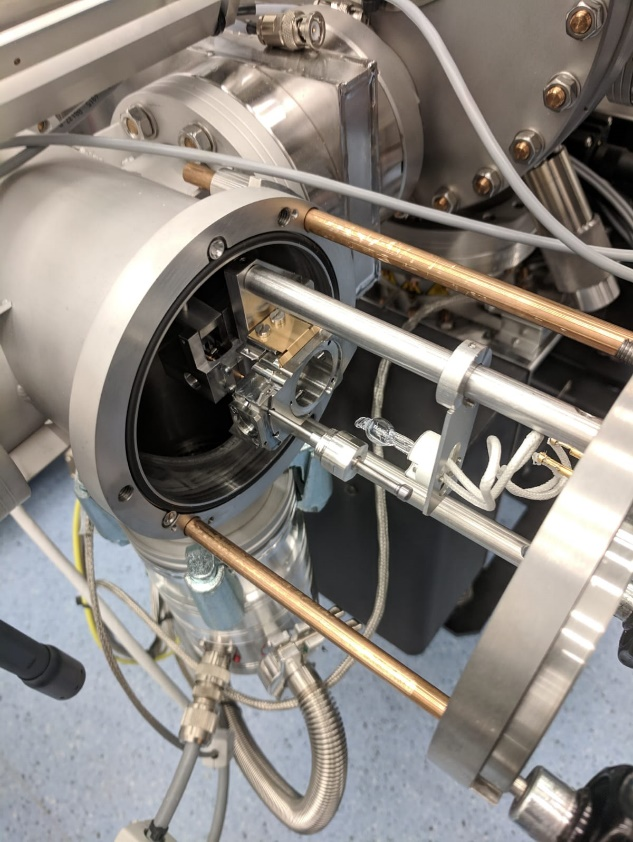    
  2.                                                                                                                                                                                                                      
  3.  Load a shuttle into the airlock (without a holder) and put the emitter into one of the holes so that it is very close to the light.                                                                       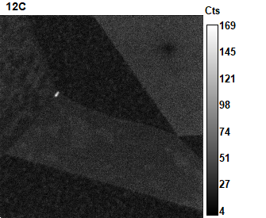                                                                            
                                                                                                                                                                                                                        
  3.  Pump the airlock                                                                                                                                                                                                  
                                                                                                                                                                                                                        
  4.  Turn on the airlock light (50% intensity) for about 2 hours.                                                                                                                                                      
----
  1.  Turn off the source/make sure the source is turned off and leave to cool for 1 hour                                                                                                                               
                                                                                                                                                                                                                        
  2.  Turn off HV on the keyboard                                                                                                                                                                                       
                                                                                                                                                                                                                        
  3.  Open the nitrogen bottle to inflate the balloon                                                                                                                                                                   
                                                                                                                                                                                                                        
  4.  Vent the source chamber from the vacuum window on the computer                                                                                                                                                    
                                                                                                                                                                                                                        
  5.  Turn on the oven to 110 °C                                                                                                                                                                                        
                                                                                                                                                                                                                        
  6.  Place foil in the laminar flow cabinet ready for source chamber                                                                                                                                                   
                                                                                                                                                                                                                        

  1.  Stop the water flow on the chiller. Using a ==10 mm spanner== stop the outgoing water by turning the valve on the pipe labelled ‘physics’, then turn the valve for ‘return physics’.                                  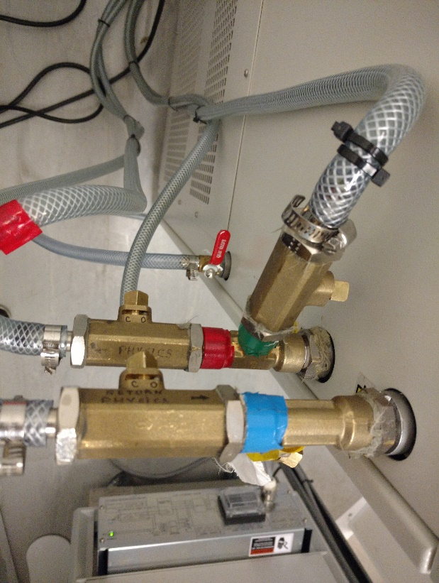
                                                                                                                                                                                                                        

  1.  Place the water tray under the drain pipes under O~2~ cylinder at the back of the machine                                                                                                                         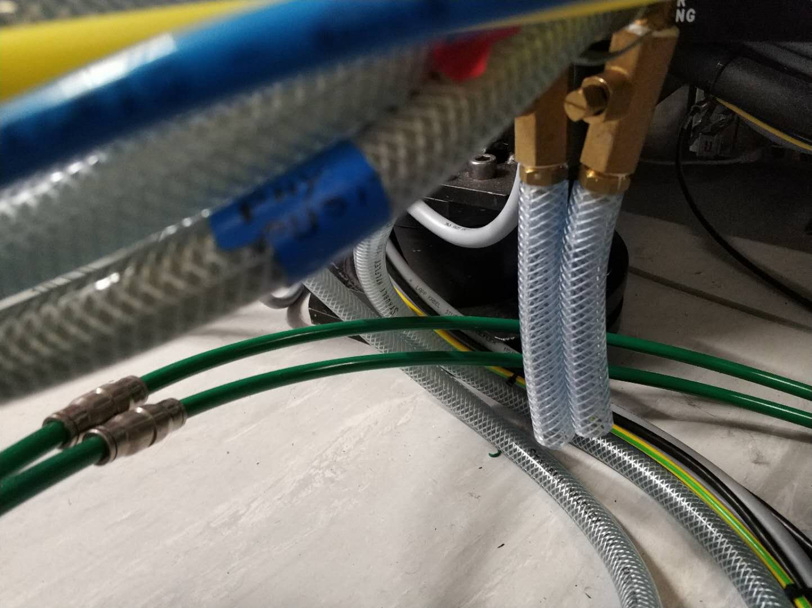
                                                                                                                                                                                                                        
  2.  Release water pressure in the physics water pipes by opening the drain (==7 mm spanner==).                                                                                                                            
                                                                                                                                                                                                                        
  3.  Close the drain valve                                                                                                                                                                                             
                                                                                                                                                                                                                        

  1.  Disconnect the water from the source chamber                                                                                                                                                                      ![[image4.jpeg|300]]
                                                                                                                                                                                                                        
      -   Have blue roll handy and place the tray under the pipes to catch any leaking water                                                                                                                            
                                                                                                                                                                                                                        
      -   Remove the green pipes from the connectors                                                                                                                                                                    
                                                                                                                                                                                                                        
      -   Connect the hoses together on the source chamber                                                                                                                                                              
                                                                                                                                                                                                                        
      -   Connect together the pipes remaining on the machine.                                                                                                                                                          
                                                                                                                                                                                                                        
      -   Turn the chiller water back on by reversing the process in step 11.                                                                                                                                           
                                                                                                                                                                                                                        

  1.  Move gonio fully to the upper limit \~4.0                                                                                                                                                 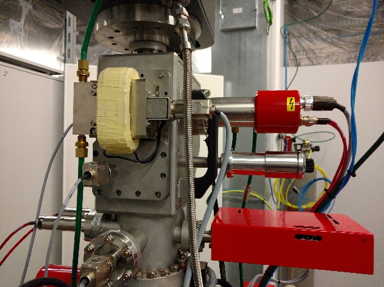
                                                                                                                                                                                                                        
  2.  Undo all 5 cables ( marked with a yellow dot) to the source chamber and Wein Filter (not the cable on the left side of the chamber)                                                                               
              
              
              
        **Source:** [[Cs source]]
**Creation Date:** 18.05.21 - 12:18
**Image: X:** 256 pixels **Y:** 256 pixels **Z:** 25 planes with 8 **images**
**Dwell time:** 1000 $\mu$s, 65.536 s/plane
**Sample stage position: X:** -11889 $\mu$m **Y:** 837 $\mu$m **Z:** 3193 $\mu$m
**Raster size:** 20.0 $\mu$m
**Primary Current initial:** 12900 pA **final:** 12805 pA
**D0-0  DCs-0  D1-3 ES-1  AS-0  EnS-0**
**Bfield:** 1723607 DAC **Q:** 352 DAC   **LF4:** 1675 DAC **Hex:** 500 DAC

| Detector | Symbol   | Radius     | Mass     | Neg plate | Pos plate | Deflection Val. |
| -------- | -------- | ---------- | -------- | --------- | --------- | --------------- |
| T-1      | 12C      | 219.837 mm | 11.9998  | -50 DAC   | -50 V     | -7.4 V          |
| T-2      | 16O      | 253.848 mm | 16.0000  | 55 DAC    | 55 V      | 7.9 V           |
| T-3      | 28Si     | 335.807 mm | 27.9996  | 3 DAC     | 3 V       | 0.3 V           |
| T-4      | 11B 16O2 | 416.155 mm | 43.0014  | -107 DAC  | -107 V    | -15.8 V         |
| T-5      | 52Cr 16O | 523.321 mm | 68.0000  | -7 DAC    | -7 V      | -1.1 V          |
| T-7      | 56Fe 16O | 538.491 mm | 71.9994  | -86 DAC   | -86 V     | -12.7 V         |
| T-8      | 96Mo 16O | 671.616 mm | 111.9990 | 52 DAC    | 52 V      | 7.5 V           |
| SE       | SE       |            |          |           |           |                 |

##### [[NanoSIMS image results]]

###### [[Images overview]]
|                                      |                                      |                                  |
| ------------------------------------ | ------------------------------------ | -------------------------------- |
| **12 - [[12C]]**                     | **16 - [[16O]]**                     | **28 - [[28Si]]**                |
|       | ![[2021_05_17_1_27_16O _T.png]]      | ![[2021_05_17_1_27_28Si _T.png]] |
| **43 - [[11B 16O2]]**                | **68 - [[52Cr 16O]]**                | **[[SE]]**                       |
| ![[2021_05_17_1_27_11B 16O2 _T.png]] | ![[2021_05_17_1_27_52Cr 16O _T.png]] | ![[2021_05_17_1_27_SE_T.png]]    |
| **72 - [[56Fe 16O]]**                | **112 - [[96Mo 16O]]**               | mass_sym_9                       |
| ![[2021_05_17_1_27_56Fe 16O _T.png]] | ![[2021_05_17_1_27_96Mo 16O _T.png]] | mass_im_9                        |

###### [[Line profiles]]

###### [[Depth profiles]]

 

 
##### Summary
      
              
              
              
              
              
              
              
              
              
              
              
              
              
              
              
              
              
              
  3.  Undo the black earth cable (10mm spanner)                                                                                                                                                 
                                                                                                                                                                                                                        
  > Remove the water cooling block from the Wien Filter (WF) (2x 3mm allen) (inner screws)                                                                                                                              

  1.  Loosen the screws to the WF coil (4x 3mm Allen bolts on front panel with the coil) then remove it. Place it in the laminar flow cabinet and wrap with Al foil                                                                                                                                                                                              

  1.  Undo the 4mm Allen bolts on the side panel (with the handle)                                                                                                                                                      
                                                                                                                                                                                                                        
  2.  Take out the Cs source section (note it doesn’t come straight out, you have to angle it)                                                                                                                          
                                                                                                                                                                                                                        
  3.  Place in the laminar flow cabinet                                                                                                                                                                                 
                                                                                                                                                                                                                        
  4.  []{#_Ref1988925 .anchor}Look inside the chamber to check for loose particles at the bottom of the chamber. Clean up bits with isopropanol on a cloth. Hoover, taking care that bits don’t fall down the column.   
                                                                                                                                                                                                                        

  1.  If very dirty (like pictured), take out limiter at bottom of source chamber (outer small screws),                                                                                                                 {width="2.752083333333333in" height="2.5861111111111112in"}
                                                                                                                                                                                                                        
  2.  Unscrew central part (large screws),                                                                                                                                                                              
                                                                                                                                                                                                                        
  3.  Polish both parts using unipol metal polish.                                                                                                                                                                      
                                                                                                                                                                                                                        
  4.  Put foil over the source chamber and WF opening and wrap the WF                                                                                                                                                   
                                                                                                                                                                                                                        

  1.  []{#_Ref1988792 .anchor}On the source, undo bridge holding HV connector                                                                                                                                           {width="2.75in" height="1.9201388888888888in"}
                                                                                                                                                                                                                        
  2.  Undo the **screw in the centre of the source**                                                                                                                                                                    
                                                                                                                                                                                                                        
  3.  []{#_Ref1988808 .anchor}Check the HV wire and ceramic for charring                                                                                                                                                
                                                                                                                                                                                                                        
  4.  []{#_Ref1988677 .anchor}Undo the screws on the plate holding white cables holding all the cables together                                                                                                         
                                                                                                                                                                                                                        
  5.  []{#_Ref1988623 .anchor}Undo the 2 screws holding down the half-moon ceramic                                                                                                                                      
                                                                                                                                                                                                                        
  6.  Using 2 screwdrivers, gently prise up the half-moon ceramic from the brass pin connectors (you don’t need to unscrew the cables)                                                                                  
                                                                                                                                                                                                                        

                                                                                                                                                                                                                        

  1.  []{#_Ref1988563 .anchor}Remove the 5 outer Allen bolts (see diagram above, 2.5 mm) while holding cooling plate down                                                                                               
                                                                                                                                                                                                                        

  1.  []{#_Ref1988539 .anchor}Turn upside down and remove the 4 Allen bolts [[]{#OLE_LINK4 .anchor}]{#OLE_LINK3 .anchor}(2.5mm), hold the bottom or it will fall out.                                                   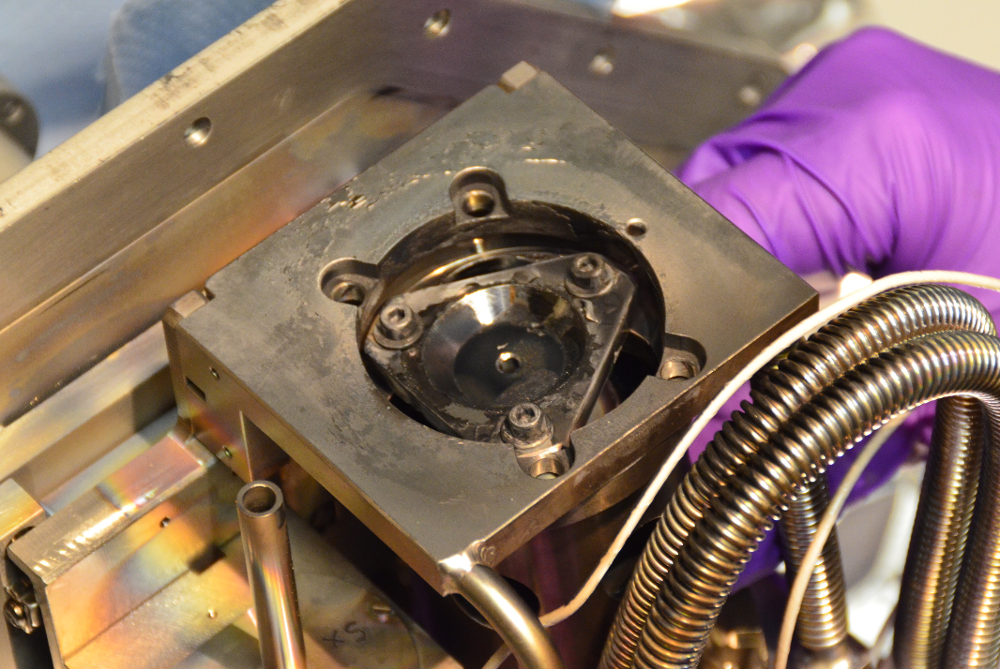{width="2.720138888888889in" height="1.7902777777777779in"}
                                                                                                                                                                                                                        
  2.  Take out the source cylinder through the side hole                                                                                                                                                                
                                                                                                                                                                                                                        
  3.  Move the source assembly out of the way                                                                                                                                                                           
                                                                                                                                                                                                                        

  **Instructions if just cleaning the extractor plate:**                                                                                                                                                                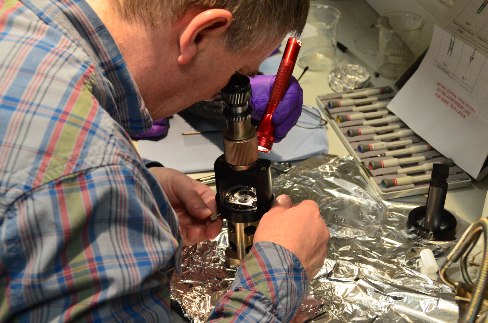{width="2.8712871828521433in" height="4.274717847769029in"}
                                                                                                                                                                                                                        
  1.  Attach the ocular device onto the cylinder and secure it tightly. This is to ensure that the extractor plate will go back to its aligned position when you reattach it.                                           
                                                                                                                                                                                                                        
  2.  Unscrew the three Allen bolts and washers                                                                                                                                                                         
                                                                                                                                                                                                                        
  3.  Unscrew the extractor plate                                                                                                                                                                                       
                                                                                                                                                                                                                        
  4.  Clean the extractor plate with Unipol metal polish                                                                                                                                                                
                                                                                                                                                                                                                        
  5.  Sonicate in distilled water then isopropanol                                                                                                                                                                      
                                                                                                                                                                                                                        
  6.  Dry in the oven at 110°C for at least 10 minutes                                                                                                                                                                  
                                                                                                                                                                                                                        
  7.  Reattach the extractor plate, check with the ocular device that the plate is still centred on the source. If not, follow the alignment instructions below.                                                        
                                                                                                                                                                                                                        

  **Instructions if replacing the Cs emitter:**                                                                                                                                                                         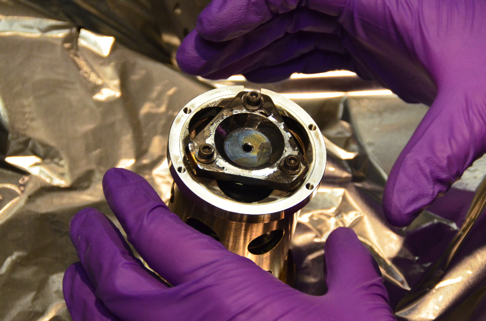{width="2.827166447944007in" height="2.3861384514435695in"}
                                                                                                                                                                                                                        
  1.  []{#_Ref1988008 .anchor}Unscrew the extractor plate – this and the screws and washers need cleaning:                                                                                                              
                                                                                                                                                                                                                        
      -   Polish by unipol                                                                                                                                                                                              
                                                                                                                                                                                                                        
      -   Ultrasonic in distilled water with a little soap (one squirt from bathroom dispensers),                                                                                                                       
                                                                                                                                                                                                                        
      -   Ultrasonic in isopropanol,                                                                                                                                                                                    
                                                                                                                                                                                                                        
      -   Dry at 110°C in the oven                                                                                                                                                                                      
                                                                                                                                                                                                                        
  -   **Note** that there are:                                                                                                                                                                                          
                                                                                                                                                                                                                        
      -   4x small washers from the holder                                                                                                                                                                              
                                                                                                                                                                                                                        
      -   3x large washers from the extractor                                                                                                                                                                           
                                                                                                                                                                                                                        

  1.  To insert the new source undo the five Allen bolts, hold onto the bottom and take the source assembly out by lifting up from the cylinder                                                                         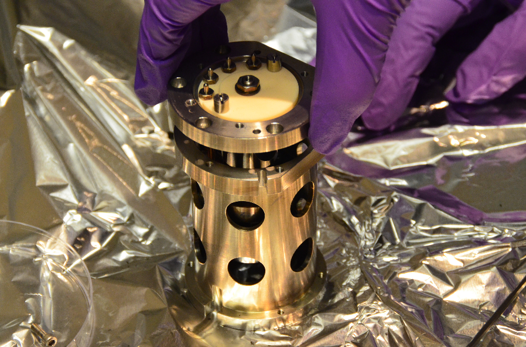
                                                                                                                                                                                                                        
  2.  Place the cylinder into the distilled water and clean and dry as in step 45 (no need to polish)                                                                                                                   
                                                                                                                                                                                                                        

  1.  Loosen the holding screw inside at the bottom                                                                                                                                                                     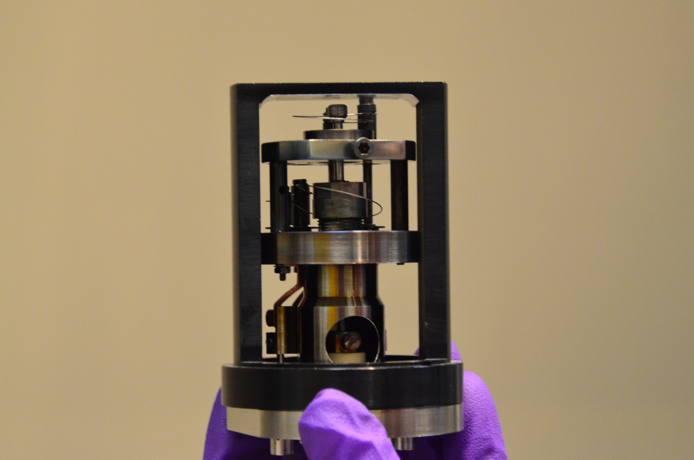
                                                                                                                                                                                                                        

  1.  **Note:** it is possible to take out the source without removing the ioniser filament, you can do this if the plate under the ioniser filament is not very dirty                                                  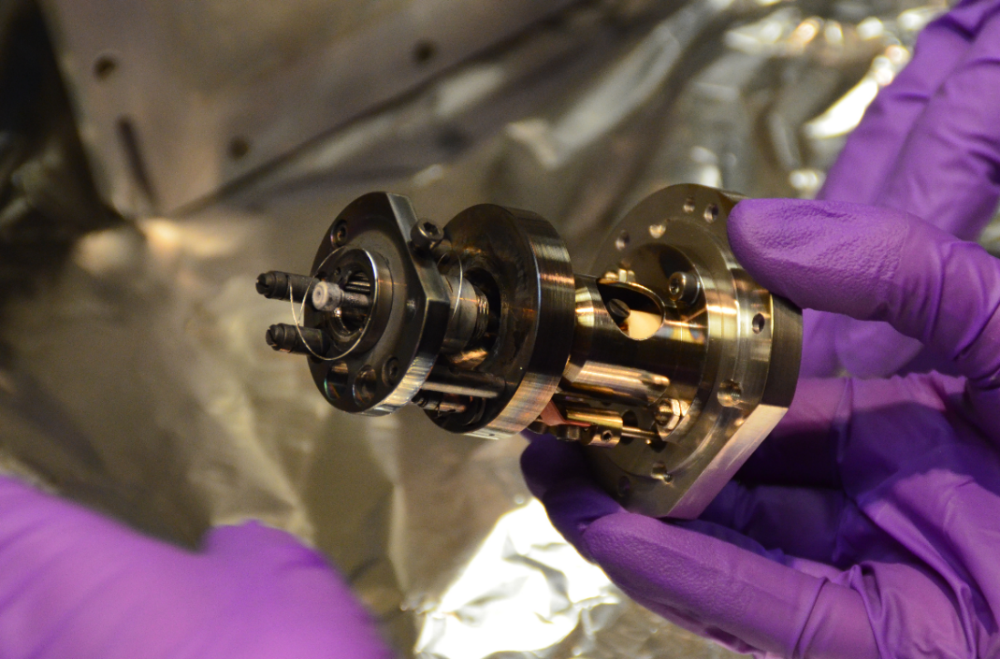
                                                                                                                                                                                                                        
  2.  If removing plate:                                                                                                                                                                                                
                                                                                                                                                                                                                        
      -   Unscrew the attachments for the ioniser                                                                                                                                                                       
                                                                                                                                                                                                                        
      -   Unscrew the top plate                                                                                                                                                                                         
                                                                                                                                                                                                                        
      -   This top plate and screw will also need cleaning/polishing as above.                                                                                                                                          
                                                                                                                                                                                                                        
      -   Pull out the old emitter                                                                                                                                                                                      
                                                                                                                                                                                                                        
  3.  If not removing plate:                                                                                                                                                                                            
                                                                                                                                                                                                                        
      -   Pull out emitter using pliers                                                                                                                                                                                 
                                                                                                                                                                                                                        

  1.  As the source should be only be exposed to air for a maximum of ***1 hour***, finish all the cleaning and drying of the components before venting the airlock to take out the Cs emitter                          
                                                                                                                                                                                                                        

  **Slide the new source into the assembly:**                                                                                                                                                                           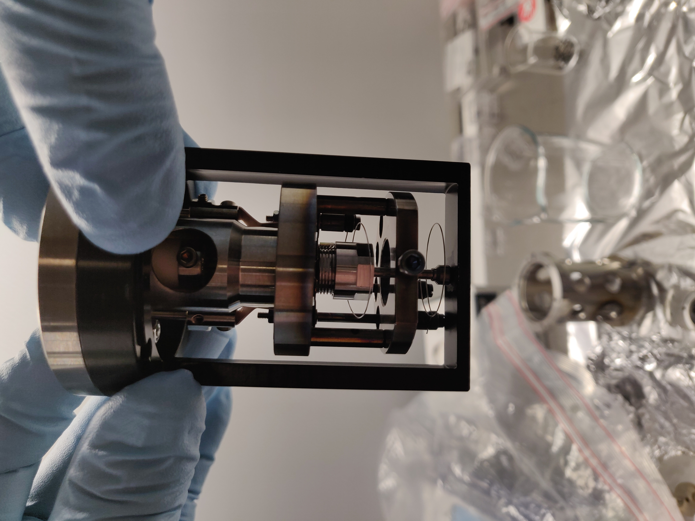{width="2.386347331583552in" height="2.4956485126859143in"}
                                                                                                                                                                                                                        
  1.  Slide the source height device over the top of the assembly and turn upside down so that the tip of the source touches the inside of the device as shown                                                          {width="2.739643482064742in" height="4.079207130358705in"}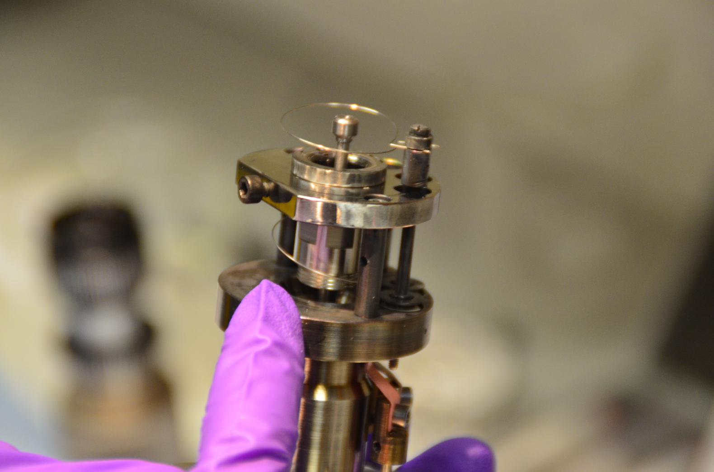{width="2.3465277777777778in" height="1.8923611111111112in"}
                                                                                                                                                                                                                        
  2.  Tighten the screw at the bottom to hold the source in place                                                                                                                                                       
                                                                                                                                                                                                                        
  3.  Remove source height device                                                                                                                                                                                       
                                                                                                                                                                                                                        
  4.  Replace the top plate and screw in.                                                                                                                                                                               
                                                                                                                                                                                                                        
  5.  Replace the ioniser filament taking care to ensure that the coil is wrapped around the larger part of the end of the source (careful – fragile filament)                                                          
                                                                                                                                                                                                                        
  6.  Put cylinder back on assembly – use the staining to align in correct way                                                                                                                                          
                                                                                                                                                                                                                        
  7.  To align the new source it is necessary to use the device with the ocular lens, position this on top of the source cylinder                                                                                       
                                                                                                                                                                                                                        
  8.  Use a torch to illuminate the inside of the cylinder                                                                                                                                                              
                                                                                                                                                                                                                        
  9.  Focus the ocular on the tip of the Cs source to get a feel for it first                                                                                                                                           
                                                                                                                                                                                                                        
  10. Screw the extractor plate back on (hole up)                                                                                                                                                                       
                                                                                                                                                                                                                        
  11. Try to align visually then put the ocular back on and again use the torch to align the extractor plate                                                                                                            
                                                                                                                                                                                                                        
  12. The extractor plate is pushed by the rim of the ocular                                                                                                                                                            
                                                                                                                                                                                                                        
      -   Illuminate the source tip – i.e. under the extractor plate, and align the ocular using the 3 screws on the side such that the tip is in the cross hairs, refocus on extractor and centre                      
                                                                                                                                                                                                                        
      -   The plate should now be in the right place, tighten the screws on the extractor plate and check the alignment stays good by checking with illumination on all sides                                           
                                                                                                                                                                                                                        

  1.  Put the cylinder back in place and screw in holding allen bolts (x4) See step 35.                                                                                                                                 
                                                                                                                                                                                                                        

  1.  Turn it over, put the base cooling plate in place and screw in 5 x allen bolts, see step 34.                                                                                                                      
                                                                                                                                                                                                                        

  1.  Replace the half-moon ceramic + screw in (2 screws), see step 32                                                                                                                                                  
                                                                                                                                                                                                                        
  2.  Reconnect the white cables (need two fingers to hold the cable, screwdriver and tweezers, i.e. 4 hands) – use multimeter to follow cables. See step [[]{#OLE_LINK6 .anchor}]{#OLE_LINK5 .anchor}31.               
                                                                                                                                                                                                                        

  1.  Screw in bridge to hold cables, see step 31.                                                                                                                                                                      
                                                                                                                                                                                                                        
  2.  Fit the HV electrode (which goes flat side up) and screw in holding bridge, see step 28-30.                                                                                                                       
                                                                                                                                                                                                                        

  1.  Replace the source chamber and the Wien filter, see step 16-23.                                                                                                                                                   
                                                                                                                                                                                                                        
  2.  Start pumping the source                                                                                                                                                                                          
                                                                                                                                                                                                                        
  3.  Reconnect all the cables and hoses (leave water hoses until turbo is pumping properly)                                                                                                                            
                                                                                                                                                                                                                        
  4.  Turn water back on                                                                                                                                                                                                
                                                                                                                                                                                                                        
      -   Move the gonio to “Cs+ position”                                                                                                                                                                              
                                                                                                                                                                                                                        
      -   Allow source to pump to 10^-7^ Torr                                                                                                                                                                           
                                                                                                                                                                                                                        
      -   Turn on HV                                                                                                                                                                                                    
                                                                                                                                                                                                                        
  ------------------------------------------------------------------------------------------------------------------------------------------------------------------------------------------------------------------------------------------------------------------------------------------------------------------------------------------------------------------------------------------------------------------------------------------------------

YOU MUST FOLLOW THE PROCEDURE FOR BRINGING UP A NEW CS+ SOURCE BEFORE
USING

[[[]{#OLE_LINK9 .anchor}]{#OLE_LINK8 .anchor}]{#OLE_LINK7
.anchor}**Procedure for Bringing up a new Caesium Source**

When bringing up a new caesium source, patience is the key. It can take
up to a few days to fully bring a new source up to working conditions.
The main indicators that must be watched while starting a new source are
the source chamber vacuum and the FCp current. The vacuum is especially
important. Ideally, it should be in the 10^-7^ to the 10^-6^ range. If
it gets up to the high 10^-5^ range (eg 9x10^-5^), then everything must
be put to zero and one must wait for the vacuum to decrease again.

1.  Turn on HV if you haven’t already done it

2.  First put the vacuum controls in manual mode. This will allow the
    user to work at conditions in the source chamber up to 10^-5^ Torr.
    If you don’t do this when the vacuum reaches 1.2 x10^-5^ the red Cs+
    safety light on the vacuum window will come on and then you will
    have to restart the computer or do a param connect to be able to
    apply more current. If all the currents, leak and HV read zero in
    real measure you have lost communication.

3.  Once the vacuum is down to the 10^-7^ range, set the high voltage to
    the source to 8000V, and check if there is arcing occurs.

    -   If there is arcing, it should open source again and check all
        the cables and connections

    -   If there is no arcing, set HV = 700 V ( if HV&lt;500V, the Cs
        source will not start)

4.  Start heating the ionizer.

    -   Start at 0.01mA then 0.02, 0.05, 0.1, 0.12, 0.15, 0.17, 0.2.
        Watch the vacuum on the multi-gauge controller as it will
        increase when the ionizer is started.

    -   It may take 1-3 days to get past the 0.01mA stage as the ioniser
        current will need to be put back to 0 mA each time the vacuum
        gets to 5x10^-5^ Torr.

    -   Once the vacuum stops increasing and drops down to the low
        10^-6^ range, increase the ionizer to the next step. When the
        current reaches 0.02 mA the green light on the source chassis
        labelled “ionizer heater” should be on.

5.  Once the vacuum is staying in the 10^-6^ range, you can switch the
    vacuum controls back to auto.

6.  Continue increasing ionizer by small increments (i.e. 0.2 mA --&gt;
    0.25 --&gt; 0.3 --&gt; 0.35 --&gt; etc.), always waiting until
    vacuum stops increasing and begins to drop

7.  When the ionizer reaches 0.7 mA, incrementally increase (500V steps)
    the high voltage to 8000V. There may be some outgassing. When
    7000-8000V is reached, some current may be seen in FCp.

8.  Resume increasing the ionizer. When the ionizer reaches about 1 mA
    to 1.1 mA, let it bake at that current for an hour, keeping an eye
    on the vacuum. If it is near the end of the day, you can leave the
    ionizer to bake at this setting overnight

9.  When ionizer value reaches about 1.3 mA, start to bring up the
    reservoir in a similar incremental manner starting at 0.01, 0.02,
    0.05 etc. This will probably outgas like the ioniser but should be
    quicker.

10. When the reservoir hits 0.2 mA, the green light on the source
    chassis labelled “reservoir heater” will come on. At this point,
    there should be more current in Fcp, a few nA

11. Wait until the vacuum begins to decrease as well as the Fcp current
    before increasing the reservoir current further.

12. Incrementally bring the reservoir current up to about 0.3 mA (or
    leave at 0.2 if the current is fine) and let it sit there. The Fcp
    current at this point will be very unstable, so wait until it levels
    out

13. Final target values for the source are 1.7 mA for the ionizer, 0.15
    mA for the reservoir, and 8000V for the high voltage

